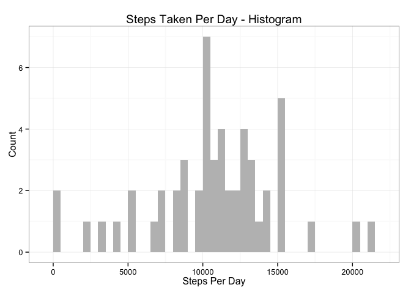

# PA1_template

*Marc Durbin*  
*November 15, 2015*

Prepare R for knitr

```r
library(knitr)
opts_chunk$set(echo = TRUE, results = 'hold')
```

Read in the dataset and process the data:


```r
if(!file.exists("./data")){dir.create("./data")}

# download compressed file and decompress it
fileUrl <- "https://d396qusza40orc.cloudfront.net/repdata%2Fdata%2Factivity.zip"
download.file(fileUrl, destfile = "./data/activity.zip", method = "curl")
unzip(zipfile="./data/activity.zip", exdir = "./data")

# get file type
list.files("./data")

# read csv file into R and create dataframe
data <- read.csv("./data/activity.csv")

# convert classes
data$date <- as.Date(data$date, format = "%Y-%m-%d")
data$interval <- as.factor(data$interval)

# inspect raw data
summary(data)
```

```
## [1] "activity.csv" "activity.zip"
##      steps             date               interval    
##  Min.   :  0.00   Min.   :2012-10-01   0      :   61  
##  1st Qu.:  0.00   1st Qu.:2012-10-16   5      :   61  
##  Median :  0.00   Median :2012-10-31   10     :   61  
##  Mean   : 37.38   Mean   :2012-10-31   15     :   61  
##  3rd Qu.: 12.00   3rd Qu.:2012-11-15   20     :   61  
##  Max.   :806.00   Max.   :2012-11-30   25     :   61  
##  NA's   :2304                          (Other):17202
```

Create a histogram of the total number of steps taken each day:


```r
library(ggplot2)

steps_per_day <- aggregate(steps ~ date, data, sum)
colnames(steps_per_day) <- c("date","steps")

ggplot(steps_per_day, aes(x = steps)) + 
        geom_histogram(fill = "gray", binwidth = 500) + 
        labs(title="Steps Taken Per Day - Histogram", 
             x = "Steps Per Day", y = "Count") + theme_bw()
```

 

Mean number of steps taken each day is 10766.19

```r
steps_mean   <- mean(steps_per_day$steps, na.rm=TRUE)
steps_mean
```

```
## [1] 10766.19
```
Median number of steps taken each day is 10765

```r
steps_median <- median(steps_per_day$steps, na.rm=TRUE)
steps_median
```

```
## [1] 10765
```
Time series plot of the average number of steps taken (averaged across all days) versus the 5-minute intervals:

```r
steps5int <- aggregate(data$steps, by = list(interval = data$interval), FUN=mean, na.rm=TRUE)

steps5int$interval <- as.integer(levels(steps5int$interval)[steps5int$interval])
colnames(steps5int) <- c("interval", "steps")

ggplot(steps5int, aes(x=interval, y=steps)) +   
        geom_line(color="black", size=1) +  
        labs(title="Average Daily Activity", x="5-min Intervals", y="Avg Number of Steps Taken")
```

 

```r
max_steps <- steps5int[which.max(steps5int$steps),]
max_steps$interval
```

```
## [1] 835
```
The 835th interval is the 5-minute interval that, on average, contains the maximum number of steps.

```r
max_steps$steps
```

```
## [1] 206.1698
```
The maximum number of steps at the 835th 5-minute interval is 206.

###Strategy for imputing missing data
Number of NAs is 2304

```r
summary(data)
```

```
##      steps             date               interval    
##  Min.   :  0.00   Min.   :2012-10-01   0      :   61  
##  1st Qu.:  0.00   1st Qu.:2012-10-16   5      :   61  
##  Median :  0.00   Median :2012-10-31   10     :   61  
##  Mean   : 37.38   Mean   :2012-10-31   15     :   61  
##  3rd Qu.: 12.00   3rd Qu.:2012-11-15   20     :   61  
##  Max.   :806.00   Max.   :2012-11-30   25     :   61  
##  NA's   :2304                          (Other):17202
```
Our strategy for imputing missing data will be to use the mean value and replace all NAs.

```r
na_fill <- function(data, pervalue) {
        na_index <- which(is.na(data$steps))
        na_replace <- unlist(lapply(na_index, FUN=function(idx){
                interval = data[idx,]$interval
                pervalue[pervalue$interval == interval,]$steps
        }))
        fill_steps <- data$steps
        fill_steps[na_index] <- na_replace
        fill_steps
}

data_fill <- data.frame(  
        steps = na_fill(data, steps5int),  
        date = data$date,  
        interval = data$interval)
```
Check first 10 observations in "steps" column, before and after:

```r
data[1:10,1]
data_fill[1:10,1]
```

```
##  [1] NA NA NA NA NA NA NA NA NA NA
##  [1] 1.7169811 0.3396226 0.1320755 0.1509434 0.0754717 2.0943396 0.5283019
##  [8] 0.8679245 0.0000000 1.4716981
```
Confirm non-existence of NAs:

```r
sum(is.na(data_fill$steps))
```

```
## [1] 0
```
Histogram of the total number of steps taken each day after missing values have been imputed.

```r
fill_steps_per_day <- aggregate(steps ~ date, data_fill, sum)
colnames(fill_steps_per_day) <- c("date","steps")

ggplot(fill_steps_per_day, aes(x = steps)) + 
        geom_histogram(fill = "red", binwidth = 500) + 
        labs(title="Steps Taken Per Day - Histogram", 
             x = "Steps Per Day", y = "Count")
```

 

```r
steps_mean_fill   <- mean(fill_steps_per_day$steps, na.rm=TRUE)
steps_median_fill <- median(fill_steps_per_day$steps, na.rm=TRUE)
```
Median value differs slightly from the estimates from the first part of the assignment, but mean value remains unchanged. The impact of imputing missing data on the estimates of the total daily number of steps appears to be trivial, although frequency increases.

Code below is for comparing the average number of steps taken per 5-minute interval across weekdays and weekends

```r
weekdays_steps <- function(data) {
        weekdays_steps <- aggregate(data$steps, by=list(interval = data$interval), FUN=mean, na.rm=T)
        weekdays_steps$interval <- as.integer(levels(weekdays_steps$interval)[weekdays_steps$interval])
        colnames(weekdays_steps) <- c("interval", "steps")
        weekdays_steps
        }

data_by_weekdays <- function(data) {
        data$weekday <- as.factor(weekdays(data$date))
        weekend_data <- subset(data, weekday %in% c("Saturday","Sunday"))
        weekday_data <- subset(data, !weekday %in% c("Saturday","Sunday"))
        
        weekend_steps <- weekdays_steps(weekend_data)
        weekday_steps <- weekdays_steps(weekday_data)
        
        weekend_steps$dayofweek <- rep("weekend", nrow(weekend_steps))
        weekday_steps$dayofweek <- rep("weekday", nrow(weekday_steps))
        
        data_by_weekdays <- rbind(weekend_steps, weekday_steps)
        data_by_weekdays$dayofweek <- as.factor(data_by_weekdays$dayofweek)
        data_by_weekdays
        }

data_weekdays <- data_by_weekdays(data_fill)

head(data_weekdays)
```

```
##   interval       steps dayofweek
## 1        0 0.214622642   weekend
## 2        5 0.042452830   weekend
## 3       10 0.016509434   weekend
## 4       15 0.018867925   weekend
## 5       20 0.009433962   weekend
## 6       25 3.511792453   weekend
```

###Panel Plot
 
for comparing the average number of steps taken per 5-minute interval across weekdays and weekends


```r
ggplot(data_weekdays, aes(x=interval, y=steps)) + geom_line(color="red") + 
        facet_wrap(~ dayofweek, nrow=2, ncol=1) + labs(x="Interval", y="Steps")
```

 
